# BluePlanet CRM - Capacitor Native Mobile Implementation Blueprint
**Project:** BluePlanet CRM (Meta Campaign & WhatsApp Lead Management)  
**Target:** Native Android (APK/AAB) & iOS (IPA) via Capacitor  
**Strategy:** Strategy 2 — Hosted Vercel Wrapper (`server.url`)  
**Status:** Approved Architectural Blueprint (Ready for Staged Execution)  

---

## 1. Executive Summary & Strategic Architecture

The CRM system is composed of:
1. **Frontend (`crm-frontend-next`):** Next.js 16.3.4, React 19.2.8, Tailwind CSS v4, Lucide icons, `@dnd-kit`, `@xyflow/react`, and `socket.io-client`. Hosted on Vercel (`https://customer-relationship-management-cr-eight.vercel.app`).
2. **Backend (`crm_imeth`):** Express.js, Prisma ORM, PostgreSQL, Redis, BullMQ workers, and Socket.IO real-time event broadcasting (`PORT 4000` / public HTTPS API).

### Why Strategy 2 (Hosted Wrapper) Is The Single Viable Architecture
- **Preserves Dynamic Next.js Routes:** Routes like `/leads/[id]` and `/flows/[id]` rely on database-generated IDs at runtime. In static export (`output: 'export'`), these dynamic segments fail to build without static pre-generation and 404 inside local WebViews.
- **Maintains URL Rewrites & SSR:** Next.js rewrites in `next.config.ts` remain fully functional on Vercel.
- **Instant Over-The-Air (OTA) Updates:** Any UI fix, pipeline stage tweak, or bug fix pushed to GitHub deploys to Vercel instantly without submitting new builds to Google Play or Apple App Store.
- **Full Native Bridge Access:** Capacitor injects its JavaScript bridge (`window.Capacitor`) into remote pages loaded via `server.url`, allowing 100% access to Camera, Push Notifications, Biometrics, and In-App Browser.

```mermaid
graph TD
    subgraph Mobile Device
        NativeShell[Capacitor Native Container (iOS / Android)]
        WebView[WKWebView / Chrome Custom WebView]
        Preferences[(Native Encrypted Storage @capacitor/preferences)]
        InAppBrowser[In-App Browser Custom Tab @capacitor/browser]
        NativePush[Push Notifications FCM / APNs]
    end

    subgraph Cloud Infrastructure
        Vercel[Vercel Hosted Next.js 16 Frontend]
        ExpressAPI[Express Backend: api.yourcrm.com]
        SocketServer[Socket.IO Server: wss://api.yourcrm.com]
        RedisWorker[BullMQ + Redis Worker]
        MetaWebhooks[Meta WhatsApp Webhook]
    end

    NativeShell --> WebView
    WebView -- "Loads Remote Web App" --> Vercel
    WebView -- "Secure Bearer JWT + x-tenant-id" --> ExpressAPI
    WebView -- "WSS Socket Connection" --> SocketServer
    WebView -- "Stores Auth Tokens" --> Preferences
    WebView -- "External Client Links" --> InAppBrowser
    RedisWorker -- "Dispatches Push on Lead" --> NativePush
    MetaWebhooks --> ExpressAPI
```

---

## 2. The 4 Critical Production Enhancements (Audit & Solutions)

### 2.1. Enhancement 1: Apple ITP Auth Trap & Cross-Origin Bearer Token Storage
- **The Vulnerability:** iOS WKWebView enforces Intelligent Tracking Prevention (ITP). Any session relying on cross-origin cookies between `capacitor://localhost` and your external API domain (`api.yourcrm.com`) is stripped or blocked on iOS.
- **The Solution:** 
  - Store `token`, `tenantId`, and `user` using `@capacitor/preferences` on native platforms with a transparent fallback to `localStorage` in desktop browsers.
  - Inject `Authorization: Bearer <token>` and `x-tenant-id` explicitly on every HTTP request in `api-client.ts`.
  - Preserve all existing custom features in `api-client.ts` (`ApiError` handling, quota metadata, 401 lockout return URLs).

#### Implementation Blueprint: `crm-frontend-next/src/lib/api-client.ts`
```typescript
import { Preferences } from '@capacitor/preferences';
import { Capacitor } from '@capacitor/core';

const TOKEN_KEY = 'token';
const TENANT_KEY = 'tenantId';
const USER_KEY = 'user';

function getApiBase(): string {
  const envUrl = process.env.NEXT_PUBLIC_API_URL;
  if (!envUrl) return 'http://localhost:4000/api';
  const trimmed = envUrl.trim().replace(/\/+$/, '');
  if (trimmed.startsWith('http') && !trimmed.endsWith('/api')) {
    return `${trimmed}/api`;
  }
  return trimmed;
}

const API_BASE = getApiBase();

// Native-Safe Storage Helpers
export async function getStoredToken(): Promise<string | null> {
  if (Capacitor.isNativePlatform()) {
    const { value } = await Preferences.get({ key: TOKEN_KEY });
    return value;
  }
  if (typeof window !== 'undefined') {
    return localStorage.getItem(TOKEN_KEY);
  }
  return null;
}

export async function getStoredTenantId(): Promise<string | null> {
  if (Capacitor.isNativePlatform()) {
    const { value } = await Preferences.get({ key: TENANT_KEY });
    return value;
  }
  if (typeof window !== 'undefined') {
    return localStorage.getItem(TENANT_KEY);
  }
  return null;
}

export async function setStoredAuth(token: string, tenantId: string, user: unknown): Promise<void> {
  if (Capacitor.isNativePlatform()) {
    await Preferences.set({ key: TOKEN_KEY, value: token });
    await Preferences.set({ key: TENANT_KEY, value: tenantId });
    await Preferences.set({ key: USER_KEY, value: JSON.stringify(user) });
    return;
  }
  if (typeof window !== 'undefined') {
    localStorage.setItem(TOKEN_KEY, token);
    localStorage.setItem(TENANT_KEY, tenantId);
    localStorage.setItem(USER_KEY, JSON.stringify(user));
  }
}

export async function clearStoredAuth(): Promise<void> {
  if (Capacitor.isNativePlatform()) {
    await Preferences.remove({ key: TOKEN_KEY });
    await Preferences.remove({ key: TENANT_KEY });
    await Preferences.remove({ key: USER_KEY });
    return;
  }
  if (typeof window !== 'undefined') {
    localStorage.removeItem(TOKEN_KEY);
    localStorage.removeItem(TENANT_KEY);
    localStorage.removeItem(USER_KEY);
  }
}

export interface ApiResponse<T = unknown> {
  success: boolean;
  data?: T;
  error?: string;
  message?: string;
  code?: string;
  title?: string;
  quota?: Record<string, unknown>;
  pagination?: {
    total: number;
    page: number;
    limit: number;
    totalPages: number;
  };
}

export class ApiError extends Error {
  code?: string;
  title?: string;
  quota?: Record<string, unknown>;
  statusCode?: number;
  remainingAttempts?: number;
  lockoutUntil?: string;
  isLocked?: boolean;
  data?: Record<string, unknown>;

  constructor(
    message: string,
    options?: {
      code?: string;
      title?: string;
      quota?: Record<string, unknown>;
      statusCode?: number;
      remainingAttempts?: number;
      lockoutUntil?: string;
      isLocked?: boolean;
      data?: Record<string, unknown>;
    }
  ) {
    super(message);
    this.name = 'ApiError';
    this.code = options?.code;
    this.title = options?.title;
    this.quota = options?.quota;
    this.statusCode = options?.statusCode;
    this.remainingAttempts = options?.remainingAttempts;
    this.lockoutUntil = options?.lockoutUntil;
    this.isLocked = options?.isLocked;
    this.data = options?.data;
  }
}

export async function apiClient<T = unknown>(
  endpoint: string,
  options: RequestInit = {}
): Promise<ApiResponse<T>> {
  const token = await getStoredToken();
  const tenantId = await getStoredTenantId();

  const headers: Record<string, string> = {
    'Content-Type': 'application/json',
    'Cache-Control': 'no-cache, no-store, must-revalidate',
    'Pragma': 'no-cache',
    ...(token ? { Authorization: `Bearer ${token}` } : {}),
    ...(tenantId ? { 'x-tenant-id': tenantId } : {}),
    ...((options.headers as Record<string, string>) || {}),
  };

  let cleanEndpoint = endpoint.startsWith('/') ? endpoint : `/${endpoint}`;
  if (cleanEndpoint.startsWith('/api/')) {
    cleanEndpoint = cleanEndpoint.slice(4);
  }

  const response = await fetch(`${API_BASE}${cleanEndpoint}`, {
    cache: 'no-store',
    ...options,
    headers,
  });

  const isAuthEndpoint = cleanEndpoint.startsWith('/auth/') && cleanEndpoint !== '/auth/refresh';
  const isAlreadyOnLoginPage = typeof window !== 'undefined' && window.location.pathname === '/login';

  if (response.status === 401 && !isAuthEndpoint && !isAlreadyOnLoginPage) {
    if (typeof window !== 'undefined') {
      const currentPath = `${window.location.pathname}${window.location.search}${window.location.hash}`;
      await clearStoredAuth();

      const safeReturnUrl = currentPath && currentPath !== '/' && currentPath !== '/login'
        ? `&returnUrl=${encodeURIComponent(currentPath)}`
        : '';
      window.location.href = `/login?expired=true${safeReturnUrl}`;
    }
    return { success: false, error: 'Session expired. Please log in again.' } as ApiResponse<T>;
  }

  const data = await response.json().catch(() => ({}));
  if (!response.ok) {
    throw new ApiError(data.error || 'API Request Failed', {
      code: data.code,
      title: data.title,
      quota: data.quota,
      statusCode: response.status,
      remainingAttempts: typeof data.remainingAttempts === 'number' ? data.remainingAttempts : undefined,
      lockoutUntil: typeof data.lockoutUntil === 'string' ? data.lockoutUntil : undefined,
      isLocked: Boolean(data.isLocked || response.status === 423),
      data,
    });
  }
  return data as ApiResponse<T>;
}
```

---

### 2.2. Enhancement 2: External Link Trapping Prevention
- **The Vulnerability:** When an agent taps an external client website link in a lead's notes, timeline, or company profile, the WebView navigates directly to that third-party URL inside the shell. Because native shells lack a browser navigation toolbar, the user cannot navigate back and is permanently trapped until force-quitting the app.
- **The Solution:** 
  - Install `@capacitor/browser`.
  - Create a dedicated link handler utility `openExternalLink(url)`.
  - Add a global document click interceptor in the dashboard layout to catch all external links and open them in an in-app browser sheet (Safari View Controller on iOS, Chrome Custom Tabs on Android).

#### Implementation Blueprint: `crm-frontend-next/src/lib/open-external.ts`
```typescript
import { Browser } from '@capacitor/browser';
import { Capacitor } from '@capacitor/core';

export async function openExternalLink(url: string): Promise<void> {
  if (!url) return;

  const trimmed = url.trim();
  const validUrl = trimmed.startsWith('http://') || trimmed.startsWith('https://')
    ? trimmed
    : `https://${trimmed}`;

  if (Capacitor.isNativePlatform()) {
    await Browser.open({
      url: validUrl,
      windowName: '_blank',
      presentationStyle: 'popover',
      toolbarColor: '#0A2540',
    });
    return;
  }

  window.open(validUrl, '_blank', 'noopener,noreferrer');
}
```

#### Global Link Interceptor (Root Layout / Dashboard Provider)
```typescript
useEffect(() => {
  if (!Capacitor.isNativePlatform()) return;

  const handleGlobalClick = (event: MouseEvent) => {
    const target = (event.target as HTMLElement)?.closest('a');
    if (!target) return;

    const href = target.getAttribute('href');
    if (!href) return;

    // Intercept external links or links targeting _blank
    if (href.startsWith('http') && !href.includes(window.location.hostname)) {
      event.preventDefault();
      openExternalLink(href);
    }
  };

  document.addEventListener('click', handleGlobalClick);
  return () => document.removeEventListener('click', handleGlobalClick);
}, []);
```

---

### 2.3. Enhancement 3: Android Hardware & Media Permissions
- **The Vulnerability:** CRM users must take photos of lead documents, scan business cards, or upload PDF contracts. Without explicit media and camera permissions, Android 13+ and Android 14+ will crash or throw a silent file picker denial.
- **The Solution:** Configure complete Android permissions in `android/app/src/main/AndroidManifest.xml`.

#### Implementation Blueprint: `android/app/src/main/AndroidManifest.xml`
```xml
<?xml version="1.0" encoding="utf-8"?>
<manifest xmlns:android="http://schemas.android.com/apk/res/android">

    <!-- Network & Internet Access -->
    <uses-permission android:name="android.permission.INTERNET" />
    <uses-permission android:name="android.permission.ACCESS_NETWORK_STATE" />

    <!-- Push Notifications (Android 13+) -->
    <uses-permission android:name="android.permission.POST_NOTIFICATIONS" />

    <!-- Camera Access (Receipts, Profile Photos, Document Scan) -->
    <uses-permission android:name="android.permission.CAMERA" />
    <uses-feature android:name="android.hardware.camera" android:required="false" />

    <!-- Media & Document Uploads (Android 13+ Granular Permissions) -->
    <uses-permission android:name="android.permission.READ_MEDIA_IMAGES" />
    <uses-permission android:name="android.permission.READ_MEDIA_VIDEO" />

    <!-- Legacy Storage Permissions (Android 12 and below) -->
    <uses-permission 
        android:name="android.permission.READ_EXTERNAL_STORAGE" 
        android:maxSdkVersion="32" />
    <uses-permission 
        android:name="android.permission.WRITE_EXTERNAL_STORAGE" 
        android:maxSdkVersion="28" />

    <application
        android:allowBackup="true"
        android:icon="@mipmap/ic_launcher"
        android:label="@string/app_name"
        android:roundIcon="@mipmap/ic_launcher_round"
        android:supportsRtl="true"
        android:theme="@style/AppTheme"
        android:usesCleartextTraffic="true">

        <activity
            android:configChanges="orientation|keyboardHidden|keyboard|screenSize|locale|smallestScreenSize|screenLayout|uiMode"
            android:name=".MainActivity"
            android:label="@string/title_activity_main"
            android:theme="@style/AppTheme.NoActionBarLaunch"
            android:launchMode="singleTask"
            android:exported="true">

            <intent-filter>
                <action android:name="android.intent.action.MAIN" />
                <category android:name="android.intent.category.LAUNCHER" />
            </intent-filter>

        </activity>

        <provider
            android:name="androidx.core.content.FileProvider"
            android:authorities="${applicationId}.fileprovider"
            android:exported="false"
            android:grantUriPermissions="true">
            <meta-data
                android:name="android.support.FILE_PROVIDER_PATHS"
                android:resource="@xml/file_paths" />
        </provider>

    </application>

</manifest>
```

---

### 2.4. Enhancement 4: iOS Hardware Usage Descriptions (`Info.plist`)
- **The Vulnerability:** Apple automated App Store Connect upload scanners immediately reject binaries if iOS privacy keys are missing from `Info.plist`.
- **The Solution:** Add all descriptive justifications into `ios/App/App/Info.plist`.

#### Implementation Blueprint: `ios/App/App/Info.plist`
```xml
<?xml version="1.0" encoding="UTF-8"?>
<!DOCTYPE plist PUBLIC "-//Apple//DTD PLIST 1.0//EN" "http://www.apple.com/DTDs/PropertyList-1.0.dtd">
<plist version="1.0">
<dict>
    <key>CFBundleDevelopmentRegion</key>
    <string>en</string>
    <key>CFBundleDisplayName</key>
    <string>BluePlanet CRM</string>
    <key>CFBundleExecutable</key>
    <string>$(EXECUTABLE_NAME)</string>
    <key>CFBundleIdentifier</key>
    <string>$(PRODUCT_BUNDLE_IDENTIFIER)</string>
    <key>CFBundleInfoDictionaryVersion</key>
    <string>6.0</string>
    <key>CFBundleName</key>
    <string>$(PRODUCT_NAME)</string>
    <key>CFBundlePackageType</key>
    <string>APPL</string>
    <key>CFBundleShortVersionString</key>
    <string>1.0.0</string>
    <key>CFBundleVersion</key>
    <string>1</string>
    <key>LSRequiresIPhoneOS</key>
    <true/>

    <!-- Camera Upload Justification -->
    <key>NSCameraUsageDescription</key>
    <string>BluePlanet CRM requires camera access to attach photos and document captures directly to lead records.</string>

    <!-- Photo Library Read Justification -->
    <key>NSPhotoLibraryUsageDescription</key>
    <string>BluePlanet CRM requires photo library access to upload existing lead documents and receipt images.</string>

    <!-- Photo Library Save Justification -->
    <key>NSPhotoLibraryAddUsageDescription</key>
    <string>BluePlanet CRM requires permission to save exported reports and lead attachments to your photos.</string>

    <!-- Biometric Authentication Justification -->
    <key>NSFaceIDUsageDescription</key>
    <string>BluePlanet CRM requires Face ID to securely authenticate sales agents into their accounts.</string>

    <key>UILaunchStoryboardName</key>
    <string>LaunchScreen</string>
    <key>UIMainStoryboardFile</key>
    <string>Main</string>
    <key>UIRequiredDeviceCapabilities</key>
    <array>
        <string>armv7</string>
    </array>
    <key>UISupportedInterfaceOrientations</key>
    <array>
        <string>UIInterfaceOrientationPortrait</string>
        <string>UIInterfaceOrientationLandscapeLeft</string>
        <string>UIInterfaceOrientationLandscapeRight</string>
    </array>
    <key>UIViewControllerBasedStatusBarAppearance</key>
    <true/>
</dict>
</plist>
```

---

## 3. End-to-End Phased Implementation Roadmap

```mermaid
gantt
    title Phased Capacitor Implementation Execution
    dateFormat  X
    axisFormat %d
    section Phase 1: Backend
    CORS & Origin Whitelisting              :active, p1, 0, 1
    section Phase 2: Frontend
    Preferences Storage, External Links, Safe Areas :p2, 1, 3
    section Phase 3: Capacitor
    Init capacitor.config.ts & Dependencies :p3, 3, 4
    section Phase 4: Native Shells
    Generate android/ container & Manifest  :p4, 4, 6
    section Phase 5: Hardware & LifeCycle
    Back Button, Status Bar, Push Sync      :p5, 6, 8
    section Phase 6: Build & Test
    Compile APK & Verify on Device          :p6, 8, 10
```



### Phase 1: Backend CORS & Socket Whitelisting
**Target File:** `crm_imeth/src/index.js`
1. Add mobile webview origins to `ALLOWED_ORIGINS`:
   ```javascript
   const ALLOWED_ORIGINS = [
     process.env.FRONTEND_URL || 'https://customer-relationship-management-cr-eight.vercel.app',
     'https://customer-relationship-management-crm-system-with-ojf1z9i48.vercel.app',
     'http://localhost:3000',
     'http://localhost:3001',
     'http://localhost:4000',
     'http://127.0.0.1:3000',
     'http://127.0.0.1:3001',
     // Mobile Capacitor origins
     'capacitor://localhost',
     'http://localhost',
     'https://localhost',
   ];
   ```
2. Verify Express `corsOriginHandler` and `io.cors` permits requests with `!origin` (native fetch).

### Phase 2: Frontend Native Bridges & Ergonomics
**Target Directory:** `crm-frontend-next/src/`
1. Install Capacitor frontend packages:
   ```bash
   npm install @capacitor/core @capacitor/preferences @capacitor/browser @capacitor/app @capacitor/status-bar @capacitor/haptics
   ```
2. Upgrade `src/lib/api-client.ts` with `@capacitor/preferences` storage handlers.
3. Update `src/hooks/use-auth.tsx` to read and write tokens using the new async storage helpers (`getStoredToken`, `setStoredAuth`, `clearStoredAuth`).
4. Create `src/lib/open-external.ts` and attach global external link listener.
5. In `src/app/layout.tsx`, export `viewport`:
   ```typescript
   export const viewport: Viewport = {
     width: "device-width",
     initialScale: 1,
     maximumScale: 1,
     userScalable: false,
     viewportFit: "cover",
   };
   ```

### Phase 3: Capacitor Configuration
**Target File:** `crm-frontend-next/capacitor.config.ts`
```typescript
import type { CapacitorConfig } from '@capacitor/cli';

const config: CapacitorConfig = {
  appId: 'com.blueplanet.mycrm',
  appName: 'BluePlanet CRM',
  webDir: 'public',
  server: {
    url: 'https://customer-relationship-management-cr-eight.vercel.app',
    cleartext: true,
    androidScheme: 'https'
  },
  plugins: {
    StatusBar: {
      style: 'DARK',
      backgroundColor: '#0A2540'
    }
  }
};

export default config;
```

### Phase 4: Native Android Shell Generation
In `crm-frontend-next`:
```bash
npm install @capacitor/cli @capacitor/android
npx cap add android
```
Update `android/app/src/main/AndroidManifest.xml` with permissions detailed in Section 2.3.

### Phase 5: Hardware Back Button & Lifecycle Handling
In `src/app/(dashboard)/layout.tsx`:
```typescript
import { App } from '@capacitor/app';
import { Capacitor } from '@capacitor/core';

useEffect(() => {
  if (!Capacitor.isNativePlatform()) return;

  const backHandler = App.addListener('backButton', ({ canGoBack }) => {
    // If mobile drawer is open, close drawer first
    if (mobileOpen) {
      setMobileOpen(false);
      return;
    }
    // If user is inside a lead detail or sub-page, navigate back
    if (canGoBack && pathname !== '/dashboard' && pathname !== '/login') {
      window.history.back();
    } else {
      App.exitApp();
    }
  });

  return () => {
    backHandler.then((h) => h.remove());
  };
}, [mobileOpen, pathname]);
```

### Phase 6: Compilation, Testing & Distribution
1. Build and sync native container:
   ```bash
   npx cap sync android
   ```
2. Open Android Studio:
   ```bash
   npx cap open android
   ```
3. In Android Studio:
   - Allow Gradle to sync and index dependencies.
   - Run `Build > Build Bundle(s) / APK(s) > Build APK(s)`.
   - Output binary generated at:  
     `android/app/build/outputs/apk/debug/app-debug.apk`
   - Test directly on a physical Android phone or Android emulator.
4. For Production:
   - Run `Build > Generate Signed Bundle / APK > Android App Bundle (.aab)`.
   - Submit `.aab` to Google Play Console.

---

## 4. Verification & QA Checklist

- [ ] **Auth Persistence:** Log in, close app, swipe away from recent apps, relaunch. Verify user stays logged in without hitting login screen.
- [ ] **CORS Integrity:** Verify API requests and Socket.IO connection succeed without `CORS origin` errors in Logcat / Safari Web Inspector.
- [ ] **External Links:** Tap an external link in lead notes. Verify Chrome Custom Tab / Safari View Controller opens, and closing it returns to the exact CRM screen.
- [ ] **Media & Camera:** Tap image upload on a lead attachment. Verify native camera / gallery permission prompt appears and chosen photo uploads successfully to the Express backend.
- [ ] **Notch & Safe Areas:** Verify header title and navigation buttons do not clip under camera hole punch or iOS Dynamic Island.
- [ ] **Hardware Back Button:** On Android, pressing back button closes open drawers/modals, or navigates back from `/leads/[id]` to `/leads`.

---

## 5. Execution State
This blueprint is locked and placed in documentation for deployment execution on demand. No active application code is modified in this stage.
