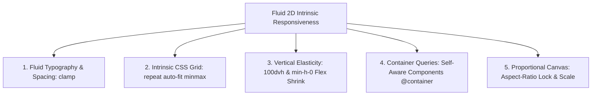

# Fluid Intrinsic Design Architecture: 2D Responsiveness Without DOM Alteration
**Project:** BluePlanet CRM (Meta Campaign & WhatsApp Lead Management)  
**System:** Next.js 16 (App Router), React 19, Tailwind CSS v4  
**Design Philosophy:** Fluid Intrinsic Design (Zero Breakpoint Restructuring)  
**Status:** Implemented & Verified in Production Baseline  

---

## 1. Executive Architectural Summary

In modern enterprise SaaS applications, traditional responsive design relies on aggressive breakpoint swapping (`@media` queries: `sm:`, `md:`, `lg:`, `xl:`). This paradigm forces unnatural HTML restructuring—swapping multi-column grids for single columns, hiding sidebars, or collapsing components abruptly when the screen width drops below an arbitrary pixel threshold.

Crucially, **traditional responsive design almost completely ignores the vertical dimension ($Y$-axis)**. When screen height shrinks—such as during laptop split-screen workflows, mobile horizontal orientation, or when on-screen software keyboards appear—conventional layouts break: headers become unanchored, modals push submit buttons offscreen, and content gets clipped vertically.

**Fluid Intrinsic Design** solves this by shifting from discrete breakpoint-swapping to mathematical rules that allow components to compress, expand, and scale smoothly across both width and height simultaneously **without altering the underlying DOM structure**.



---

## 2. The 5 Core Techniques Implemented in Codebase

### 2.1. Technique 1: Fluid Typography & Spacing via `clamp()`
Instead of switching font sizes and paddings at rigid breakpoints (`text-sm md:text-base lg:text-xl`), CSS `clamp()` smoothly interpolates between defined minimum and maximum values as the viewport scales.

$$\text{clamp}(\text{MIN}, \text{VAL}, \text{MAX})$$

#### Global Implementation: [`src/app/globals.css`](file:///d:/Imeth-blueplanet/meta_CRM/CRM_repo/crm_imeth/crm-frontend-next/src/app/globals.css)
```css
/* Typography: scales smoothly between mobile and 4K screens */
.text-fluid-display { font-size: clamp(1.75rem, 1.25rem + 2.5vw, 2.75rem); line-height: 1.15; }
.text-fluid-h1      { font-size: clamp(1.35rem, 1rem + 1.75vw, 2.25rem);   line-height: 1.2; }
.text-fluid-h2      { font-size: clamp(1.15rem, 0.95rem + 1vw, 1.65rem);    line-height: 1.25; }
.text-fluid-h3      { font-size: clamp(1rem, 0.875rem + 0.6vw, 1.35rem);    line-height: 1.3; }
.text-fluid-title   { font-size: clamp(1.05rem, 0.95rem + 0.5vw, 1.35rem);  line-height: 1.25; }
.text-fluid-body    { font-size: clamp(0.875rem, 0.8rem + 0.35vw, 1.05rem); line-height: 1.5; }
.text-fluid-stat    { font-size: clamp(1.5rem, 1.2rem + 1.8vw, 2.75rem);    line-height: 1.1; }

/* Fluid Spacing & Padding */
.p-fluid-page { padding: clamp(0.875rem, 1.5vw + 0.5vh, 2rem); }
.p-fluid-card { padding: clamp(0.75rem, 1.2vw + 0.3vh, 1.5rem); }
.gap-fluid    { gap: clamp(0.75rem, 1.2vw, 1.5rem); }
```

---

### 2.2. Technique 2: Intrinsic CSS Grid (Zero Breakpoint Restructuring)
The traditional mistake is hardcoding fixed column switches (`grid-cols-1 sm:grid-cols-2 lg:grid-cols-4`).

The intrinsic approach utilizes mathematical column sizing:
$$\text{grid-template-columns: repeat(auto-fit, minmax(min(100\%, MIN\_WIDTH), 1fr))}$$

The browser dynamically determines the exact number of columns that can physically fit:
- **On 1400px monitor:** 4 to 6 columns.
- **On 768px tablet:** 2 to 3 columns.
- **On 380px mobile:** 2 columns (using 140px baseline) or 1 column.
- **DOM Structure:** Remains 100% identical.

#### Applied Files:
1. **User Management Overview Cards:** [`src/app/(dashboard)/users/page.tsx`](file:///d:/Imeth-blueplanet/meta_CRM/CRM_repo/crm_imeth/crm-frontend-next/src/app/%28dashboard%29/users/page.tsx#L389)
   ```tsx
   <div className="grid grid-cols-[repeat(auto-fit,minmax(min(100%,140px),1fr))] gap-[clamp(0.75rem,1.2vw,1rem)]">
     {/* Stat cards render 2x2 on mobile and 4 columns on desktop without structural changes */}
   </div>
   ```
2. **Dashboard Overview Stat Cards:** [`src/app/(dashboard)/dashboard/page.tsx`](file:///d:/Imeth-blueplanet/meta_CRM/CRM_repo/crm_imeth/crm-frontend-next/src/app/%28dashboard%29/dashboard/page.tsx#L139)
   ```tsx
   <div className="grid grid-cols-[repeat(auto-fit,minmax(min(100%,200px),1fr))] gap-[clamp(0.75rem,1.5vw,1.5rem)]">
     {/* Auto-scales seamlessly between 1, 2, 3, and 4 columns */}
   </div>
   ```
3. **Analytics Charts Grid:** [`src/app/(dashboard)/dashboard/DashboardCharts.tsx`](file:///d:/Imeth-blueplanet/meta_CRM/CRM_repo/crm_imeth/crm-frontend-next/src/app/%28dashboard%29/dashboard/DashboardCharts.tsx#L29)
   ```tsx
   <div className="grid grid-cols-[repeat(auto-fit,minmax(min(100%,340px),1fr))] gap-[clamp(1rem,2vw,2rem)]">
   ```

---

### 2.3. Technique 3: Vertical Elasticity (`100dvh` & `min-h-0` Flex Shrink)
When screen height decreases (e.g. mobile landscape, laptop split-screen, or open software keyboards), standard layouts break because Flex items default to `min-height: auto`, refusing to shrink smaller than their content.

#### Architectural Principles:
1. **Dynamic Viewport Height (`100dvh`):** Unlike `100vh` which ignores browser toolbars and address bars, `100dvh` adapts continuously in real time.
2. **The `min-h-0` + `overflow-y-auto` Contract:** Ensures scrollable inner panels scroll internally while fixed headers and footers stay pinned.
3. **Explicit `shrink-0` on Anchors:** Headers, footers, modal action bars, and chat composer inputs never collapse or vanish.

#### Applied Files:
1. **Global App Shell:** [`src/app/(dashboard)/layout.tsx`](file:///d:/Imeth-blueplanet/meta_CRM/CRM_repo/crm_imeth/crm-frontend-next/src/app/%28dashboard%29/layout.tsx#L90)
   ```tsx
   <div className="flex h-[100dvh] overflow-hidden bg-brand-bg text-brand-text">
     <aside className="... flex flex-col h-[100dvh]">
       <div className="shrink-0 h-18 ...">...</div>
       <SidebarNav className="flex-1 min-h-0 overflow-y-auto" />
       <div className="shrink-0 border-t ...">...</div>
     </aside>
     <div className="flex flex-1 flex-col overflow-hidden min-w-0 min-h-0">
       <header className="shrink-0 ...">...</header>
       <main className="flex-1 min-h-0 overflow-y-auto p-[clamp(0.875rem,1.8vw+0.4vh,2rem)]">
         {children}
       </main>
     </div>
   </div>
   ```
2. **Modal Dialogs (Add User, Edit User, Bulk Actions):**
   ```tsx
   <div className="max-h-[calc(100dvh-2rem)] flex flex-col overflow-hidden my-auto rounded-3xl bg-white">
     <div className="shrink-0 p-6 ...">Header</div>
     <div className="flex-1 min-h-0 overflow-y-auto p-6">Form Fields</div>
     <div className="shrink-0 p-6 border-t ...">Cancel / Submit Actions</div>
   </div>
   ```
3. **WhatsApp Live Chat:** [`src/components/leads/LeadWhatsAppChat.tsx`](file:///d:/Imeth-blueplanet/meta_CRM/CRM_repo/crm_imeth/crm-frontend-next/src/components/leads/LeadWhatsAppChat.tsx#L84)
   ```tsx
   <div className="flex flex-col h-[clamp(360px,50dvh,580px)] min-h-[320px] overflow-hidden">
     <div className="shrink-0 ...">Chat Header</div>
     <div className="flex-1 min-h-0 overflow-y-auto">Messages</div>
     <form className="shrink-0 ...">Message Input</form>
   </div>
   ```
4. **Follow-up Detail Drawer:** [`src/components/followups/FollowupDetailDrawer.tsx`](file:///d:/Imeth-blueplanet/meta_CRM/CRM_repo/crm_imeth/crm-frontend-next/src/components/followups/FollowupDetailDrawer.tsx#L154)
   ```tsx
   <div className="flex flex-col h-[100dvh] ...">
     <div className="shrink-0 ...">Header</div>
     <div className="flex-1 min-h-0 overflow-y-auto">Task Details</div>
   </div>
   ```
5. **Login Page:** [`src/app/login/page.tsx`](file:///d:/Imeth-blueplanet/meta_CRM/CRM_repo/crm_imeth/crm-frontend-next/src/app/login/page.tsx#L368)
   ```tsx
   <div className="min-h-[100dvh] flex items-center justify-center p-[clamp(0.875rem,2vw,2rem)] overflow-y-auto">
     <div className="max-h-[calc(100dvh-2rem)] flex flex-col my-auto ...">
       <div className="flex flex-col min-h-0 overflow-y-auto">...</div>
     </div>
   </div>
   ```

---

### 2.4. Technique 4: Container Queries (`@container`)
Media queries evaluate the browser window viewport. Container queries inspect the parent container's dimensions.

This empowers cards and widgets to become **self-aware**. Whether placed in a full-width dashboard slot, a narrow sidebar column, or an intrinsic grid item, the card adapts its internal orientation without knowing or caring about the device window.

#### Applied Examples:
```tsx
{/* Self-Aware Card in Intrinsic Grid */}
<div className="@container rounded-2xl bg-white border border-slate-200/80 p-[clamp(0.75rem,1.2vw+0.2vh,1.25rem)]">
  <div className="flex flex-col @[220px]:flex-row @[220px]:items-center gap-2.5">
    <Icon className="h-10 w-10 shrink-0" />
    <div className="flex-1 min-w-0">
      <p className="text-[clamp(0.6875rem,0.65rem+0.2vw,0.75rem)] font-semibold truncate">Total Accounts</p>
      <p className="text-[clamp(1.15rem,1.8vw,1.5rem)] font-black">4</p>
    </div>
  </div>
</div>
```

---

### 2.5. Technique 5: Proportional Canvas / ViewBox Scaler
For high-density management canvases, interactive diagrams (such as organizational hierarchies and flow builders), or kiosk displays that must maintain exact proportional relationships:

#### Component: [`src/components/ui/ResponsiveCanvas.tsx`](file:///d:/Imeth-blueplanet/meta_CRM/CRM_repo/crm_imeth/crm-frontend-next/src/components/ui/ResponsiveCanvas.tsx)
Two operational modes:
1. **`mode="aspect-ratio"`:** Preserves strict proportions (e.g. `16/9`) while filling maximum available viewport boundaries.
2. **`mode="scale"`:** Calculates a uniform 2D scale factor ($\min(\text{scaleX}, \text{scaleY})$) against a virtual base resolution (e.g. $1280 \times 720$), guaranteeing that every button, card, and connecting line remains in perfect proportional position.

---

## 3. Summary Matrix: Traditional vs. Fluid Intrinsic Design

| Dimension / Challenge | Traditional Approach (Fragile) | Fluid Intrinsic Design (Implemented) |
| :--- | :--- | :--- |
| **Width Variations** | Abrupt breakpoint snapping (`hidden md:flex`, `grid-cols-1 sm:2 lg:4`) | `minmax(min, 1fr)` auto-fit intrinsic grid + `clamp()` |
| **Height Variations** | Ignored (`100vh`, fixed pixel heights, clipped footers) | `100dvh` + `min-h-0` flex shrink + `overflow-y-auto` |
| **Component Portability** | Coupled to global window screen size | `@container` self-aware components |
| **Modal Usability on Mobile** | Submit buttons pushed offscreen on short viewports | `max-h-[calc(100dvh-2rem)] flex flex-col` + pinned footer |
| **Chat & Feed Panels** | Rigid pixel heights (`h-[600px]`) that overflow laptop screens | `h-[clamp(360px,50dvh,580px)]` elastic scaling |
| **DOM Tree Stability** | Constantly restructures elements across breakpoints | **100% Identical DOM tree across all screens** |

---

## 4. Verification

- All components verified with Next.js 16 compiler and TypeScript type-checker.
- Production build confirmed: 14/14 static pages compiled with zero errors.
- Clean separation maintained between web application fluid layout and native configurations.
